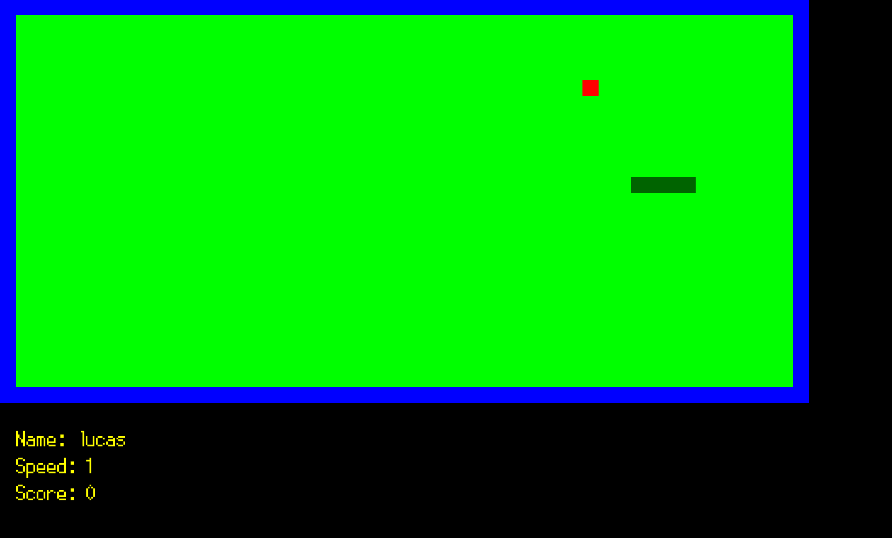

# Arcade

## An arcade machine in C

The purpose of this project was to recreate an arcade machine who gives to possibility to play to multiple games like Pacman or Nibbler with multiple graphical libraries like Ncurses, SFML or SDL2. These graphical libraries changes how the game look like.

The difficulty of this project was to build a program who offers to the player to swap between games and graphical libraries in runtime.

## Usage

``` make ```
``` ./arcade lib/arcade_ncurses.so ``` or ``` ./arcade lib/arcade_sfml.so  ``` or ``` ./arcade lib/arcade_sdl2.so ``` depending on which graphical library you wanna start with

## Features

- Use the ``` Keypad ``` to move during the game
- Change the speed of the game with ``` Y ``` to lower it and ``` U ``` to upper it
- Swap to the next graphical library with ``` A ```
- Swap to the previous graphical library with ``` E ```
- Swap to the next game with ``` D ``` (only in runtime)
- Swap to the previous game with ``` Q ``` (only in runtime)
- Restart the current game with ``` R ```
- Go back to the menu with ``` T ```
- Exit the Arcade with ``` ESC ```

## Screenshots





